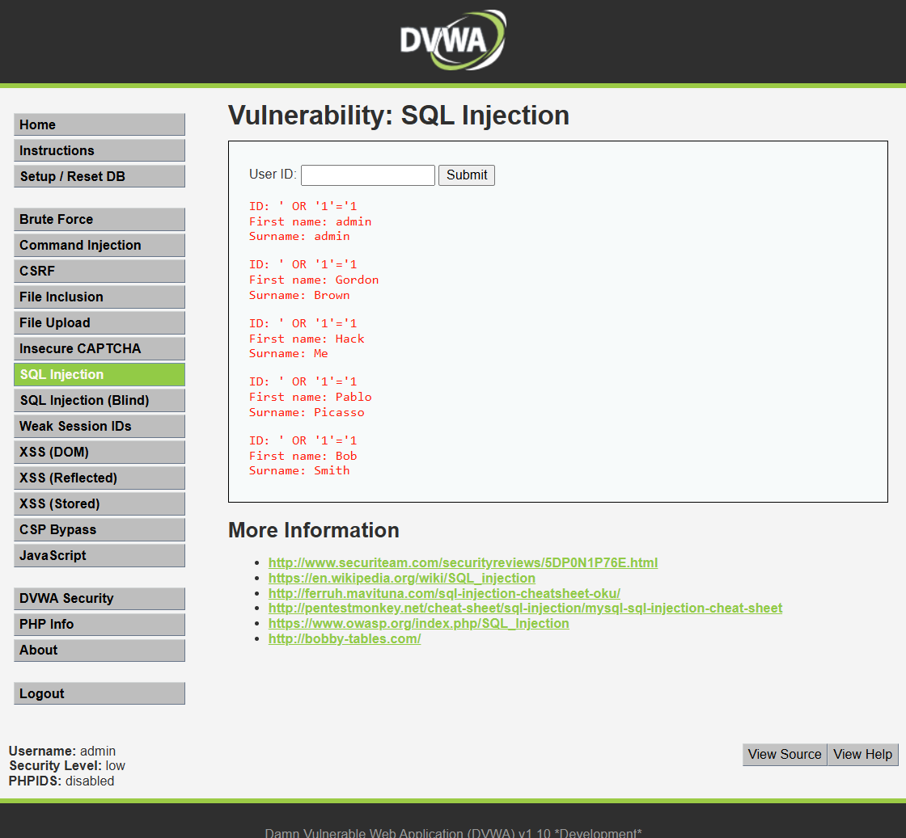

# Ataque 1 — Inyección SQL

> **Resumen rápido:** escribiendo apenas unos caracteres en un cuadro de
> búsqueda del portal, logramos que la base de datos nos entregara **la lista
> completa de usuarios** sin tener permiso para verla. Es el ataque más grave de
> los tres: gravedad **9.8 / 10 (Crítica)**.

---

## 1. La evidencia (lo que hicimos en la prueba)

En el ambiente de prueba (DVWA, nivel de seguridad *Low*), fuimos a la sección
**SQL Injection**, que tiene un campo llamado **"User ID"**. Ese campo debería
servir para buscar **un solo cliente** por su número.

En lugar de escribir un número normal, escribimos esto:

```
' OR '1'='1
```

Al pulsar **Submit**, el portal no nos mostró un cliente: nos mostró **todos los
usuarios de golpe** (admin, Gordon Brown, Hack Me, Pablo Picasso, Bob Smith).



> Traducido al negocio de VetAmigos: es como pedir en el mesón la ficha de **un**
> cliente y que el sistema, en cambio, nos entregue **el listado completo de las
> 18.000 personas registradas**. Esa información nunca debería salir así.

---

## 2. Por qué funciona

Para entenderlo, primero algo simple: el portal guarda toda la información en una
**base de datos** (una gran libreta ordenada de clientes, mascotas y pagos). Cada
vez que alguien busca un cliente, el portal le hace una **pregunta** a esa libreta.

Una pregunta normal sería: *"Tráeme al cliente cuyo número es 1."*

El problema es que el portal **arma esa pregunta pegando directamente lo que
escribe el usuario**, sin revisarlo. Entonces, cuando escribimos `' OR '1'='1`,
la pregunta deja de decir "tráeme al cliente 1" y pasa a decir, en la práctica:

> *"Tráeme al cliente 1 **o** todos los casos en que 1 sea igual a 1."*

Y como **1 siempre es igual a 1**, la condición se cumple para **todos** los
registros. Resultado: la base entrega la libreta entera.

> **La analogía:** es como una puerta con un guardia que pregunta "¿eres el
> cliente 1?". Nosotros respondemos "soy el cliente 1 **o** da igual quién sea".
> Como la segunda parte siempre es verdad, el guardia nos deja pasar siempre.

La causa de fondo es que el portal **mezcla los datos que escribe el usuario con
sus propias instrucciones internas**, y no distingue uno de otro. Esa confusión
es la "puerta mal cerrada" que aprovecha el ataque.

---

## 3. Qué tan grave es (puntaje CVSS)

Para medir la gravedad usamos **CVSS**, el estándar internacional que da una nota
de 0 a 10 a cada falla de seguridad (calculadora oficial:
https://www.first.org/cvss/calculator/3.1).

| Concepto | Valor |
|----------|-------|
| **Puntaje CVSS v3.1** | **9.8 / 10** |
| **Severidad** | **Crítica** 🟥 |
| **Vector** | `AV:N/AC:L/PR:N/UI:N/S:U/C:H/I:H/A:H` |

**¿Por qué exactamente 9.8 y no 10.0?**

El puntaje sale de evaluar siete factores independientes. Aquí cada uno con lo
que significa para VetAmigos:

| Factor | Calificación | Lo que significa para VetAmigos |
|--------|--------------|---------------------------------|
| Acceso (¿desde dónde se ataca?) | Por internet | Cualquier persona del mundo puede intentarlo sin poner un pie en el local |
| Dificultad (¿qué tan difícil es?) | Muy baja | Solo hay que escribir una frase corta en el portal; sin herramientas especiales |
| Credenciales (¿necesita cuenta?) | No | No hace falta ser cliente de VetAmigos ni tener contraseña |
| Interacción (¿necesita a alguien?) | No | Funciona solo, sin depender de que ningún cliente cometa un error |
| Confidencialidad (¿qué datos ve?) | **Todos — impacto alto** | Los ~18.000 clientes, sus fichas de mascotas y sus tarjetas de un solo golpe |
| Integridad (¿puede modificar datos?) | **Sí — impacto alto** | Podría cambiar o borrar registros de mascotas, datos de clientes o historial de pagos |
| Disponibilidad (¿puede tumbar el sitio?) | **Sí — impacto alto** | Puede dejar la base de datos inutilizable, cerrando el portal completo |

> **¿Por qué no llega a 10.0?** La única razón es técnica: el ataque queda
> "contenido" dentro de la aplicación y no da acceso directo al servidor
> completo. Eso lo hace la inyección de comandos (sección 04). En daño práctico
> sobre los datos de VetAmigos, la diferencia es casi imperceptible.

Para VetAmigos, un puntaje de **9.8 significa que esta falla es la número uno a
corregir**: pone en riesgo directo la base completa de clientes, fichas de
mascotas y medios de pago.

---

## 4. Cómo se defiende VetAmigos

### Prevención (evitar que la falla exista)

La defensa principal se llama **consultas parametrizadas** (en inglés, *prepared
statements*). Suena técnico, pero la idea es sencilla:

- En vez de **pegar** lo que escribe el usuario dentro de la pregunta a la base
  de datos, el portal envía primero la pregunta con un **hueco** reservado, y
  recién después mete el dato en ese hueco.
- Así, la base de datos trata lo que escribe el usuario **siempre como un dato**
  (un texto a buscar), **nunca como una instrucción**. Aunque alguien escriba
  `' OR '1'='1`, eso se busca tal cual, como si fuera un nombre raro, y no altera
  la pregunta.

> Es separar el "qué pregunto" del "con qué dato pregunto". El usuario solo puede
> rellenar el dato; jamás puede cambiar la pregunta.

Como apoyo, se suma **validar la entrada**: si el campo "User ID" solo debe
contener un número, el portal debe **rechazar** cualquier cosa que no sea un
número antes de continuar. Esta es la recomendación #1 de **OWASP** (la
organización de referencia mundial en seguridad web).

### Mitigación (reducir el daño si igual ocurre)

Aunque la prevención es lo primero, conviene poner capas extra por si algo falla:

- **Mínimos privilegios:** que la cuenta con la que el portal consulta la base de
  datos pueda hacer solo lo justo. Así, aunque un atacante entre, no podrá borrar
  ni modificar tablas completas.
- **Un "filtro" delante del sitio (WAF):** un sistema que detecta y bloquea frases
  típicas de ataque, como `' OR '1'='1`, antes de que lleguen al portal.
- **Cifrar los datos sensibles:** guardar las tarjetas y datos personales de
  forma cifrada, para que, aunque se filtren, no se puedan leer fácilmente.
- **Registrar y vigilar:** dejar registro de las consultas para detectar a tiempo
  un intento de robo masivo de datos y reaccionar rápido.

> **En una frase:** si VetAmigos usa consultas parametrizadas y valida lo que
> escribe el usuario, esta puerta queda **bien cerrada** y el ataque deja de
> funcionar.
