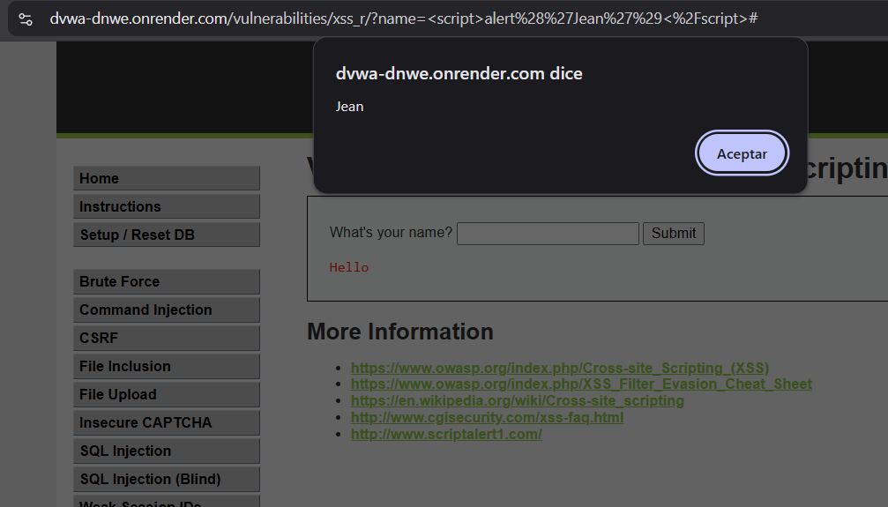

# Ataque 2 — XSS (Cross-Site Scripting reflejado)

> **Resumen rápido:** escribiendo un pequeño trozo de código en un campo de
> nombre del portal, logramos que **el navegador de la víctima ejecutara
> instrucciones nuestras** en lugar de mostrar un texto. Es un ataque de gravedad
> **6.1 / 10 (Media)**, peligroso porque ataca directamente al cliente.

---

## 1. La evidencia (lo que hicimos en la prueba)

En el ambiente de prueba (DVWA, nivel de seguridad *Low*), fuimos a la sección
**XSS (Reflected)**, que tiene un campo llamado **"What's your name?"**. Ese
campo debería servir solo para saludar: si escribes *Pedro*, la página responde
*"Hello Pedro"*.

En lugar de un nombre, escribimos esto:

```
<script>alert('Jean')</script>
```

Al pulsar **Submit**, la página no nos saludó con ese texto: el navegador
**ejecutó el código** y mostró una ventana emergente (un *pop-up*) con la palabra
"Jean". Eso demuestra que pudimos meter instrucciones que el navegador obedeció.



> Traducido al negocio de VetAmigos: es como dejar que un cliente escriba su
> nombre en un formulario, pero ese "nombre" termina siendo una **orden que la
> computadora de otra persona obedece**. En esta prueba el código solo abre un
> aviso inofensivo, pero un atacante real pondría algo dañino.

---

## 2. Por qué funciona

La página de saludo **refleja** (repite en pantalla) lo que el usuario escribe.
El problema es que repite ese texto **tal cual, sin revisarlo**, y lo mete dentro
del código de la página web.

Para el navegador, una página web es una mezcla de **texto para mostrar** e
**instrucciones para ejecutar**. Cuando escribimos `<script>...</script>`, el
navegador no lo entiende como un nombre escrito en pantalla, sino como una
**instrucción que debe ejecutar**. Y la ejecuta.

- Si escribes *Pedro* → la página muestra el texto **"Hello Pedro"**.
- Si escribes `<script>alert('Jean')</script>` → el navegador **ejecuta** ese
  código y abre la ventana emergente.

> **La analogía:** es como un cartel donde la gente escribe su nombre para
> saludarse. Alguien, en vez de su nombre, escribe *"todos los que lean esto, den
> un paso atrás"*… y la gente lo hace. El cartel debía mostrar nombres, no dar
> órdenes; aquí pasa lo mismo pero con el navegador.

La causa de fondo es la misma que en la inyección SQL: el portal **mezcla los
datos que escribe el usuario con sus propias instrucciones** y no distingue uno
de otro. Esa confusión es la "puerta mal cerrada".

**¿Por qué es peligroso si "solo abre un aviso"?** Porque ese mismo hueco permite
que un atacante prepare un enlace trampa y se lo envíe a un cliente de VetAmigos
(por correo o WhatsApp). Si el cliente hace clic estando con su sesión iniciada,
el código del atacante podría **robar su sesión** (entrar como si fuera él),
**redirigirlo** a una página falsa o **mostrarle un formulario fraudulento** que
le pida su tarjeta.

---

## 3. Qué tan grave es (puntaje CVSS)

Para medir la gravedad usamos **CVSS**, el estándar internacional que da una nota
de 0 a 10 a cada falla de seguridad (calculadora oficial:
https://www.first.org/cvss/calculator/3.1).

| Concepto | Valor |
|----------|-------|
| **Puntaje CVSS v3.1** | **6.1 / 10** |
| **Severidad** | **Media** 🟧 |
| **Vector** | `AV:N/AC:L/PR:N/UI:R/S:C/C:L/I:L/A:N` |

¿Por qué un puntaje medio y no tan alto como la inyección SQL? En palabras
simples:

- **Se ataca por internet** y **es fácil de hacer**, igual que el anterior.
- **No hace falta tener cuenta** para preparar el ataque.
- **PERO necesita que la víctima haga algo** (hacer clic en un enlace trampa). No
  se dispara solo; depende de engañar a una persona. Eso baja la nota.
- **El daño directo es menor:** afecta sobre todo a **un** usuario por vez, no a
  toda la base de datos de golpe. Por eso el impacto en confidencialidad e
  integridad se considera "bajo".

Aun siendo "Media", para VetAmigos no es algo que se pueda ignorar: un atacante
podría usarlo para **robar la cuenta de un cliente** y, con ella, ver sus datos
personales, los de sus mascotas y sus medios de pago.

---

## 4. Cómo se defiende VetAmigos

### Prevención (evitar que la falla exista)

La defensa principal se llama **escapar la salida** (en inglés, *output
encoding*). Suena técnico, pero la idea es sencilla:

- Antes de mostrar en pantalla lo que escribió el usuario, el portal debe
  **convertir los símbolos especiales en texto inofensivo**. Por ejemplo, el
  símbolo `<` se reemplaza por un código (`&lt;`) que el navegador **muestra como
  texto**, en lugar de interpretarlo como el inicio de una instrucción.
- Así, si alguien escribe `<script>alert('Jean')</script>`, en pantalla aparece
  ese texto **escrito literalmente**, como si fuera un nombre raro, y el navegador
  **no lo ejecuta**.

> Es la regla de oro: **tratar siempre lo que escribe el usuario como texto para
> mostrar, nunca como código para ejecutar.**

Como apoyo, se suma **validar la entrada**: si el campo es para un nombre, el
portal debe rechazar símbolos que un nombre normal no lleva (como `<`, `>` o
`/`). Estas son recomendaciones de **OWASP** (la organización de referencia
mundial en seguridad web).

### Mitigación (reducir el daño si igual ocurre)

Aunque la prevención es lo primero, conviene poner capas extra por si algo falla:

- **Política de seguridad de contenido (CSP):** una regla que le dice al
  navegador **qué código tiene permiso de ejecutarse** en el sitio. Si aparece un
  script intruso, el navegador lo bloquea aunque haya logrado colarse.
- **Cookies de sesión protegidas (HttpOnly):** marcar la "llave" de la sesión del
  cliente para que el código de la página **no pueda leerla**. Así, aunque ocurra
  un XSS, el atacante no logra robar la sesión.
- **Un "filtro" delante del sitio (WAF):** un sistema que detecta y bloquea
  intentos típicos de inyección de código, como `<script>`, antes de que lleguen
  al portal.
- **Registrar y vigilar:** dejar registro de entradas sospechosas para detectar a
  tiempo si alguien está intentando este ataque.

> **En una frase:** si VetAmigos muestra siempre lo que escribe el usuario como
> texto (escapando la salida) y suma una política CSP, esta puerta queda **bien
> cerrada** y el ataque deja de funcionar.
