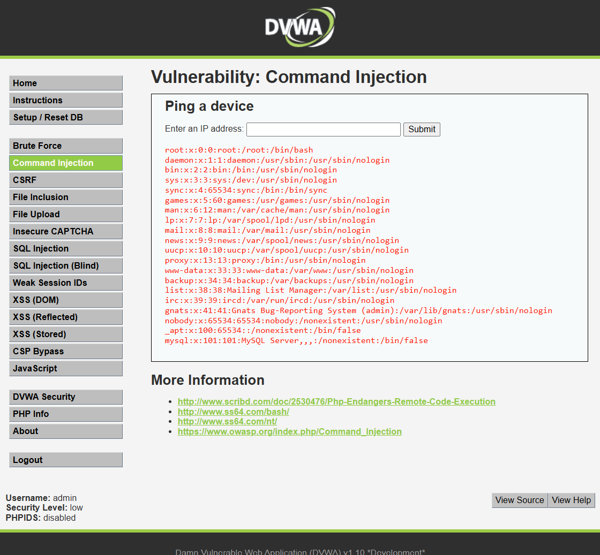

# Ataque 3 — Inyección de comandos

> **Resumen rápido:** escribiendo una dirección seguida de una orden extra en un
> campo que solo debía hacer una prueba de conexión, logramos que **el servidor
> de VetAmigos ejecutara nuestras órdenes** y nos mostrara un archivo interno con
> las cuentas del sistema. Es el ataque más grave de todos: gravedad
> **10.0 / 10 (Crítica)**, la nota máxima posible.

---

## 1. La evidencia (lo que hicimos en la prueba)

En el ambiente de prueba (DVWA, nivel de seguridad *Low*), fuimos a la sección
**Command Injection**, que tiene un campo llamado **"Enter an IP address"**. Ese
campo debería servir solo para una cosa: hacerle un *ping* a una dirección (una
prueba rápida para ver si un equipo está conectado).

En lugar de escribir solo una dirección, escribimos esto:

```
127.0.0.1; cat /etc/passwd
```

Al pulsar **Submit**, el servidor no se limitó a hacer el ping: **también
ejecutó la segunda orden** y nos mostró en pantalla el contenido del archivo
`/etc/passwd`, un archivo interno de Linux que **lista las cuentas de usuario del
servidor** (root, daemon, www-data, mysql, etc.).



> Traducido al negocio de VetAmigos: es como pedirle a un empleado que haga una
> tarea sencilla y que, en la misma frase, le agregues *"…y de paso ábreme la
> caja fuerte y muéstrame lo que hay dentro"*… y lo haga. El servidor obedeció
> una orden que jamás debió aceptar.

---

## 2. Por qué funciona

El campo está pensado para ejecutar **un solo comando** dentro del servidor: el
*ping* a la dirección que escribe el usuario. El problema es que el portal
**pega directamente lo que escribimos** dentro de esa orden, sin revisarlo.

En los servidores existe un símbolo, el punto y coma (`;`), que sirve para
**encadenar órdenes**: "haz esto; y después haz esto otro". Al escribir
`127.0.0.1; cat /etc/passwd`, el servidor entiende **dos órdenes**:

- `127.0.0.1` → hace el ping normal (inofensivo).
- `cat /etc/passwd` → **muestra el contenido** de ese archivo del sistema.

Como el portal no filtra el punto y coma, ejecuta las dos, una tras otra.

> **La analogía:** es como un buzón donde solo debías dejar **una** carta. Pero
> alguien mete dos cartas pegadas, y el cartero, sin mirar, reparte las dos. La
> segunda carta nunca debió entrar.

La causa de fondo es la misma de los otros dos ataques: el portal **mezcla los
datos que escribe el usuario con sus propias instrucciones** y no distingue uno
de otro. Esa confusión es la "puerta mal cerrada".

**¿Por qué es el más grave?** Porque aquí el atacante no solo ve datos: pasa a
**dar órdenes directamente al servidor**. En esta prueba solo leímos un archivo,
pero con la misma técnica se podría **borrar información, robar la base de datos
completa, instalar programas maliciosos o apagar el sitio**. Es, literalmente,
tomar el control del servidor de VetAmigos.

---

## 3. Qué tan grave es (puntaje CVSS)

Para medir la gravedad usamos **CVSS**, el estándar internacional que da una nota
de 0 a 10 a cada falla de seguridad (calculadora oficial:
https://www.first.org/cvss/calculator/3.1).

| Concepto | Valor |
|----------|-------|
| **Puntaje CVSS v3.1** | **10.0 / 10** |
| **Severidad** | **Crítica** 🟥 |
| **Vector** | `AV:N/AC:L/PR:N/UI:N/S:C/C:H/I:H/A:H` |

**¿Por qué exactamente 10.0, la nota máxima posible?**

El puntaje sale de evaluar siete factores. La inyección de comandos los
maximiza todos sin excepción:

| Factor | Calificación | Lo que significa para VetAmigos |
|--------|--------------|---------------------------------|
| Acceso (¿desde dónde se ataca?) | Por internet | Cualquier persona del mundo puede intentarlo sin poner un pie en el local |
| Dificultad (¿qué tan difícil es?) | Muy baja | Una sola frase corta basta; no se necesitan herramientas especiales |
| Credenciales (¿necesita cuenta?) | No | No hace falta ser cliente de VetAmigos ni tener contraseña |
| Interacción (¿necesita a alguien?) | No | Funciona solo, sin depender de que ningún cliente cometa un error |
| **Alcance (¿hasta dónde llega el daño?)** | **Rompe los límites del portal** | **Aquí está la diferencia con la inyección SQL:** el atacante ya no solo lee datos del portal; pasa a controlar la máquina entera donde vive VetAmigos |
| Confidencialidad + Integridad + Disponibilidad | **Las tres al máximo** | Puede ver todo, modificar todo y apagar todo el servidor a la vez |

> **¿Por qué llega a 10.0 y la inyección SQL solo a 9.8?** La diferencia está
> en el alcance: la inyección SQL se queda dentro del portal. La inyección de
> comandos "rompe la pared" y llega al servidor completo. En términos de
> VetAmigos: la inyección SQL expone los datos; la inyección de comandos
> entrega las **llaves de todo el negocio**.

Para VetAmigos, un puntaje de **10.0 significa el peor escenario posible**: no
solo se roban los datos de clientes, mascotas y tarjetas; un atacante puede
además borrar todo, instalar programas maliciosos o apagar el portal
permanentemente.

---

## 4. Cómo se defiende VetAmigos

### Prevención (evitar que la falla exista)

La defensa principal es **no dejar que la entrada del usuario se convierta nunca
en una orden del servidor**. Para eso:

- **Evitar mandar al sistema lo que escribe el usuario.** Lo ideal es usar
  funciones internas seguras del lenguaje en lugar de pasarle el texto
  directamente al servidor para que lo ejecute.
- **Validar con lista blanca:** si el campo es para una dirección IP, el portal
  debe aceptar **solo** un formato de IP válido (números y puntos) y **rechazar**
  cualquier otra cosa. Así, símbolos como `;`, `|` o `&`, que sirven para
  encadenar órdenes, nunca pasan.

> Es la misma idea de siempre: lo que escribe el usuario es **un dato** (una
> dirección a probar), **nunca una orden** para el servidor.

Estas son recomendaciones de **OWASP** (la organización de referencia mundial en
seguridad web).

### Mitigación (reducir el daño si igual ocurre)

Aunque la prevención es lo primero, conviene poner capas extra por si algo falla:

- **Mínimos privilegios:** que el portal funcione con una cuenta del servidor que
  pueda hacer **solo lo justo**. Así, aunque un atacante logre colar una orden, no
  podrá borrar archivos importantes ni tomar el control total.
- **Un "filtro" delante del sitio (WAF):** un sistema que detecta y bloquea
  intentos típicos de inyección de comandos, como `; cat /etc/passwd`, antes de
  que lleguen al portal.
- **Aislar el servidor:** mantener separado el portal del resto de los sistemas,
  para que un ataque no se propague a la base de datos de clientes o de pagos.
- **Registrar y vigilar:** dejar registro de las órdenes ejecutadas para detectar
  a tiempo un intento de ataque y reaccionar rápido.

> **En una frase:** si VetAmigos valida que el campo solo acepte direcciones IP
> reales y nunca pasa lo que escribe el usuario directo al servidor, esta puerta
> queda **bien cerrada** y el ataque deja de funcionar.
